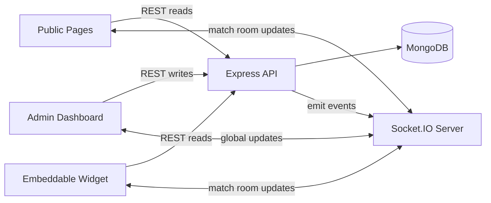
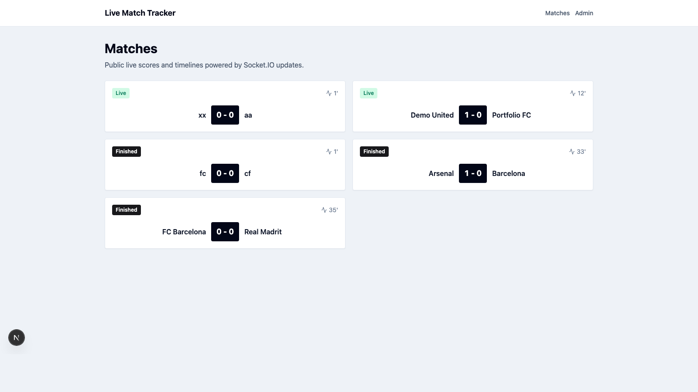
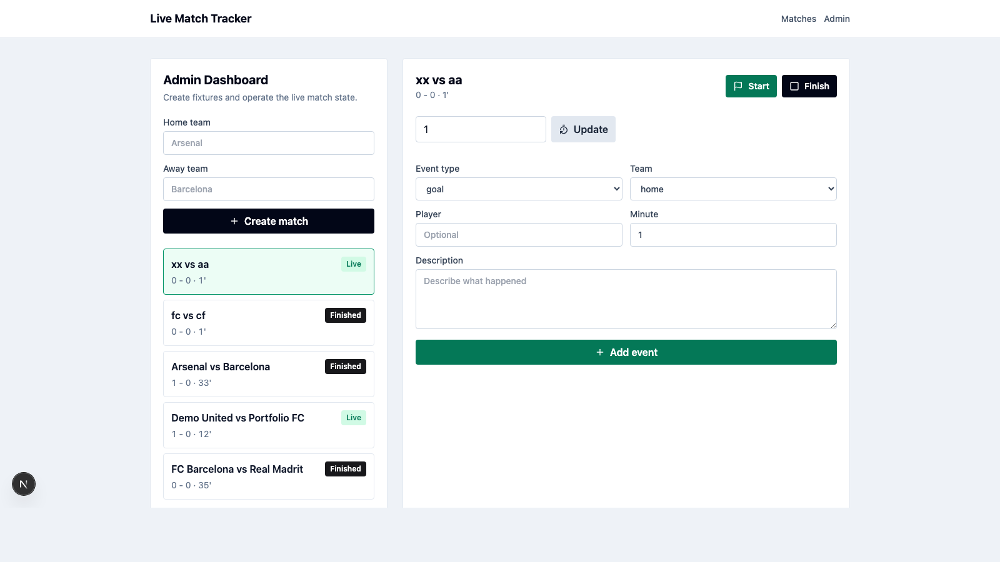
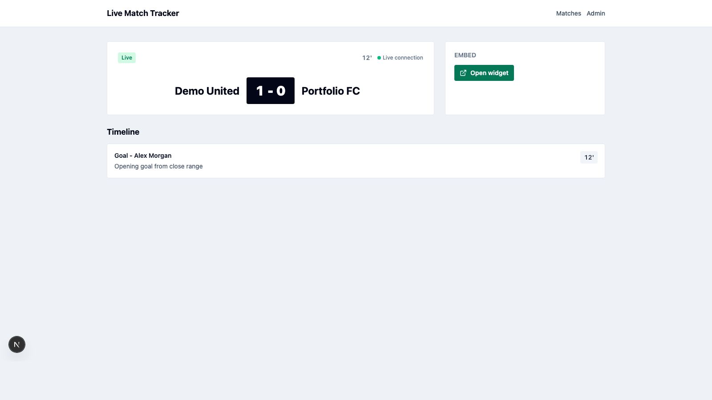
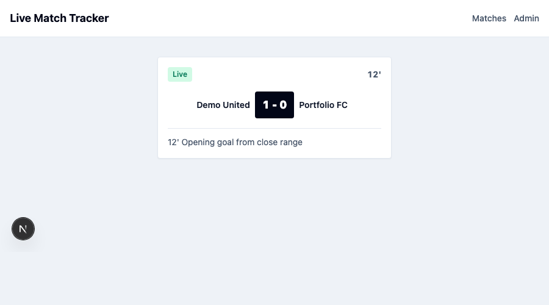

# Live Match Tracker

Live Match Tracker is a production-style full-stack demo for real-time sports data workflows. It models a common sports operations use case: an admin manages a live match feed, while public users watch scores and timeline events update without refreshing the page.

The project is intentionally scoped as a portfolio MVP. It is not presented as production-ready, but it is structured to show practical full-stack engineering decisions: API design, real-time updates, persistence, validation, Docker-based development, CI, and a UI that feels like a real internal tool.

## What This Project Demonstrates

- Full-stack TypeScript across a small monorepo
- Next.js App Router frontend with reusable UI components and responsive layouts
- Express REST API with route validation, centralized error handling, and service-layer business logic
- Socket.IO real-time updates with match-specific rooms
- MongoDB persistence with Mongoose schemas and indexes
- Admin workflows for managing live sports data
- Public-facing pages and an embeddable widget-style view
- Docker Compose local environment with MongoDB, API, and web services
- GitHub Actions CI for install, typecheck, lint, test, build, and Compose validation
- Clear production tradeoffs suitable for technical interview discussion

## Features

- Public match list showing teams, score, status, and current minute
- Match detail page with live score, connection indicator, and event timeline
- Admin dashboard for creating matches and operating live match state
- Start, finish, and minute update controls
- Event creation for goals, yellow cards, red cards, substitutions, VAR, and comments
- Automatic score updates when a goal event is assigned to the home or away team
- Inline admin validation and API error feedback
- Compact widget route at `/widget/[matchId]`
- Socket.IO updates for match creation, state changes, and new events
- Empty states, status badges, and responsive card layouts

## Architecture



The backend owns persistence and business rules. After state changes, it emits Socket.IO events globally or to a match-specific room. Public match detail pages and widgets subscribe to match-specific updates, while the match list can receive global match creation and update events.

### Monorepo Layout

```text
apps/
  api/   Express API, Socket.IO server, Mongoose models, services, validation
  web/   Next.js frontend, Tailwind UI, Socket.IO client, public/admin routes
```

## Tech Stack

| Area | Technology |
| --- | --- |
| Frontend | Next.js, React, TypeScript, Tailwind CSS |
| Backend | Node.js, Express, TypeScript |
| Realtime | Socket.IO |
| Database | MongoDB, Mongoose |
| Validation | Zod |
| Testing | Vitest |
| Tooling | npm workspaces, Docker Compose, GitHub Actions |

## REST API

| Method | Endpoint | Description |
| --- | --- | --- |
| GET | `/health` | API health check |
| GET | `/api/matches` | List matches |
| POST | `/api/matches` | Create a match |
| GET | `/api/matches/:id` | Get match details |
| PATCH | `/api/matches/:id` | Update match fields |
| GET | `/api/matches/:id/events` | List match events |
| POST | `/api/matches/:id/events` | Add a live event |
| POST | `/api/matches/:id/start` | Start a match |
| POST | `/api/matches/:id/finish` | Finish a match |

Validation is handled with Zod at the route boundary. Match lifecycle rules, scoring behavior, and event restrictions live in the service layer.

## WebSocket Events

Clients can join or leave a match room:

| Event | Payload |
| --- | --- |
| `match:join` | `matchId` |
| `match:leave` | `matchId` |

The backend emits:

| Event | Payload |
| --- | --- |
| `match:created` | `{ matchId, match }` |
| `match:updated` | `{ matchId, match }` |
| `match:event-added` | `{ matchId, match, event }` |
| `match:started` | `{ matchId, match }` |
| `match:finished` | `{ matchId, match }` |

## Local Development

Requirements:

- Node.js 20+
- npm
- MongoDB, unless using Docker Compose

```bash
nvm use
npm install
cp .env.example .env
npm run dev
```

Local URLs:

- Web: `http://localhost:3000`
- API: `http://localhost:4000`
- Health check: `http://localhost:4000/health`

For non-Docker local development, set:

```bash
MONGODB_URI=mongodb://localhost:27017/live-match-tracker
API_INTERNAL_URL=http://localhost:4000
NEXT_PUBLIC_API_URL=http://localhost:4000
NEXT_PUBLIC_SOCKET_URL=http://localhost:4000
```

## Docker Setup

Docker Compose starts the full local stack:

```bash
docker compose up --build
```

Services:

| Service | URL |
| --- | --- |
| Web | `http://localhost:3000` |
| API | `http://localhost:4000` |
| MongoDB | `mongodb://localhost:27017/live-match-tracker` |

Stop the stack:

```bash
docker compose down
```

The web service uses `API_INTERNAL_URL=http://api:4000` for server-side requests inside Docker, while browser requests use `NEXT_PUBLIC_API_URL=http://localhost:4000`.

## Environment Variables

| Variable | Description | Example |
| --- | --- | --- |
| `NODE_ENV` | Runtime environment | `development` |
| `MONGODB_URI` | MongoDB connection string | `mongodb://localhost:27017/live-match-tracker` |
| `API_PORT` | Backend port | `4000` |
| `CORS_ORIGIN` | Allowed frontend origin | `http://localhost:3000` |
| `API_INTERNAL_URL` | Server-side API URL used by the web app | `http://api:4000` in Docker |
| `NEXT_PUBLIC_API_URL` | Browser API URL | `http://localhost:4000` |
| `NEXT_PUBLIC_SOCKET_URL` | Browser Socket.IO URL | `http://localhost:4000` |

## Screenshots

### Public Match List



### Admin Dashboard



### Match Detail



### Embeddable Widget



## Roadmap

- Admin authentication and protected write routes
- Seed data command for demo environments
- Event editing and deletion
- Search and filtering for match history
- League, season, and venue fields
- Automated match clock support
- E2E tests for admin and public real-time flows
- Basic observability around API errors and Socket.IO connections

## Production Considerations

This project is a realistic demo, not a production deployment. Before using this pattern in production, I would add:

- Authentication and authorization for admin routes
- Rate limiting for write endpoints and Socket.IO connections
- Stronger domain validation for event ordering, stoppage time, and match lifecycle transitions
- Structured logging and request correlation
- Monitoring and alerting for API, database, and Socket.IO health
- Error tracking for frontend and backend failures
- Reviewed MongoDB indexes based on real query patterns
- Redis adapter for Socket.IO in multi-instance deployments
- Secrets management instead of plain local `.env` files
- Separate deployment strategy for web, API, database, and persistent storage

## Interview Talking Points

- Why match-specific Socket.IO rooms are used instead of broadcasting every event to every client
- How REST and WebSocket responsibilities are separated
- Why scoring rules live in a service instead of inside route handlers
- How the admin flow handles validation and API errors
- How Docker networking changes API URLs for server-side rendering
- What would be required to make admin routes safe for real production use
- How Socket.IO would scale horizontally with Redis
- Where additional test coverage would provide the most value

## License

MIT
