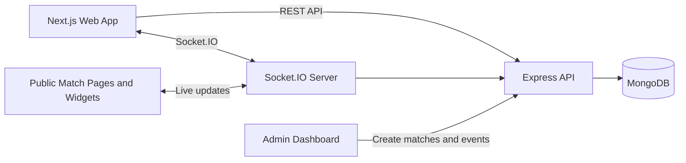

# Live Match Tracker

A full-stack sports operations dashboard for managing and watching live match updates in real time. Admin users can create fixtures, start or finish matches, update the current minute, and add live incidents. Public users can watch score and timeline changes update through Socket.IO without refreshing the page.

This is intentionally an MVP, not a production-ready platform. It is designed to be realistic, readable, and easy to discuss in technical interviews.

## What This Demonstrates

- Full-stack TypeScript development across a monorepo
- Next.js App Router UI with reusable components, responsive layouts, and live client-side updates
- Express REST API with validation, centralized error handling, and clear route structure
- Socket.IO real-time updates with match-specific rooms
- MongoDB persistence with Mongoose models and indexes
- Docker Compose local development
- GitHub Actions CI for install, typecheck, lint, test, and build
- Practical backend tests around health checks and match scoring rules
- Interview-friendly tradeoffs: clear MVP scope, documented production gaps, and simple module boundaries

## Features

- Matches list with teams, score, status, minute, and detail links
- Match detail page with live score, connection status, and event timeline
- Admin dashboard for creating and managing matches with inline validation/errors
- Live events for goals, cards, substitutions, VAR, and comments
- Automatic score updates when goal events are added
- Compact embeddable widget route at `/widget/[matchId]`
- REST API and Socket.IO event stream
- Loading, empty, and error-ready UI states
- Docker health checks for MongoDB and the API

## Tech Stack

- Frontend: Next.js, React, TypeScript, Tailwind CSS, Socket.IO client
- Backend: Node.js, Express, TypeScript, Socket.IO, Zod
- Database: MongoDB with Mongoose
- Tooling: npm workspaces, Docker Compose, GitHub Actions, Vitest, Supertest

## Architecture



The backend owns persistence and emits real-time events after state changes. Public match pages join a match-specific Socket.IO room so detail pages and widgets receive only relevant match updates.

### Monorepo Layout

```text
apps/
  api/   Express REST API, Socket.IO server, Mongoose models, service logic
  web/   Next.js App Router frontend, Tailwind UI, Socket.IO client
```

## API Endpoints

| Method | Endpoint | Description |
| --- | --- | --- |
| GET | `/health` | Service health check |
| GET | `/api/matches` | List matches |
| POST | `/api/matches` | Create a match |
| GET | `/api/matches/:id` | Get match details |
| PATCH | `/api/matches/:id` | Update match fields |
| GET | `/api/matches/:id/events` | List match events |
| POST | `/api/matches/:id/events` | Add a match event |
| POST | `/api/matches/:id/start` | Start a match |
| POST | `/api/matches/:id/finish` | Finish a match |

## WebSocket Events

The backend emits:

- `match:created` with `{ matchId, match }`
- `match:updated` with `{ matchId, match }`
- `match:event-added` with `{ matchId, match, event }`
- `match:started` with `{ matchId, match }`
- `match:finished` with `{ matchId, match }`

Clients can join and leave match rooms by emitting:

- `match:join` with a match id
- `match:leave` with a match id

## Local Setup

```bash
nvm use
npm install
cp .env.example .env
npm run dev
```

The web app runs at `http://localhost:3000` and the API runs at `http://localhost:4000`.

For non-Docker local development, make sure MongoDB is running and set:

```bash
MONGODB_URI=mongodb://localhost:27017/live-match-tracker
```

## Docker Setup

```bash
docker compose up
```

This starts:

- `web` on port `3000`
- `api` on port `4000`
- `mongodb` on port `27017`

Stop the stack with:

```bash
docker compose down
```

## Environment Variables

| Variable | Description | Default |
| --- | --- | --- |
| `NODE_ENV` | Runtime environment | `development` |
| `MONGODB_URI` | MongoDB connection string | `mongodb://localhost:27017/live-match-tracker` |
| `API_PORT` | Backend port | `4000` |
| `CORS_ORIGIN` | Allowed frontend origin | `http://localhost:3000` |
| `NEXT_PUBLIC_API_URL` | Browser API base URL | `http://localhost:4000` |
| `NEXT_PUBLIC_SOCKET_URL` | Browser Socket.IO URL | `http://localhost:4000` |

## Screenshots

Add screenshots after running the app:

- `docs/screenshots/matches.png`
- `docs/screenshots/match-detail.png`
- `docs/screenshots/admin.png`
- `docs/screenshots/widget.png`

Suggested screenshots for a portfolio README:

- Empty match list
- Admin dashboard with one live match
- Match detail page after two or three events
- Compact widget view

## Roadmap

- Admin authentication and protected routes
- League and season grouping
- Better filtering and search
- Event editing and deletion
- Match clock automation
- Seed data command for demos
- E2E tests for admin and public flows

## Production Considerations

- Authentication and authorization are required for admin routes before real use
- Rate limiting should protect write endpoints and Socket.IO connections
- Input validation should be extended for domain-specific rules such as stoppage time and event ordering
- Structured monitoring and logging should replace console logging
- Database indexes should be reviewed against real query patterns
- A Redis adapter is needed for Socket.IO in multi-instance deployments
- Deployment should separate web, API, database, and persistent volumes cleanly
- Error tracking should be added for frontend and backend failures

## Interview Notes

Good discussion points for a walkthrough:

- Why Socket.IO rooms are used for match-specific updates
- Why scoring logic is isolated from route handlers
- What would change before exposing admin routes publicly
- How the API and Socket.IO layer would scale beyond one backend instance

## License

MIT
